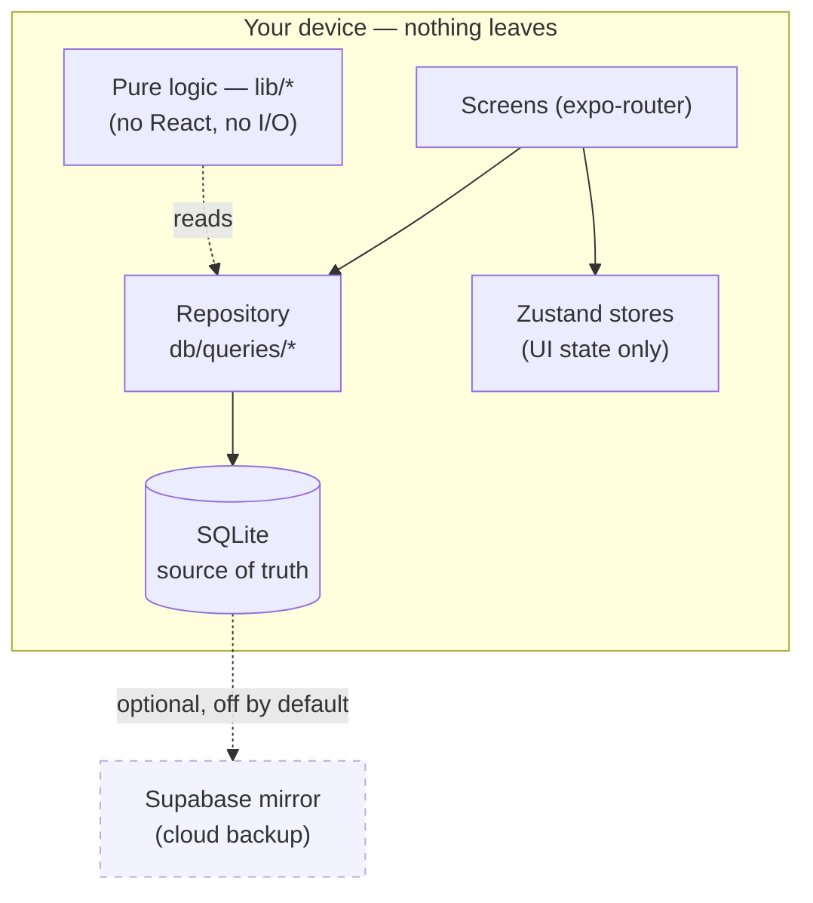
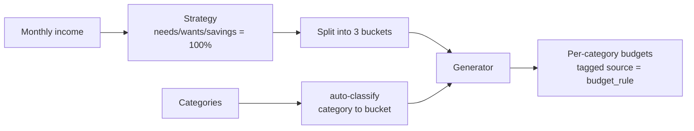
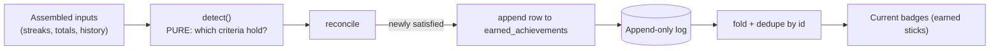
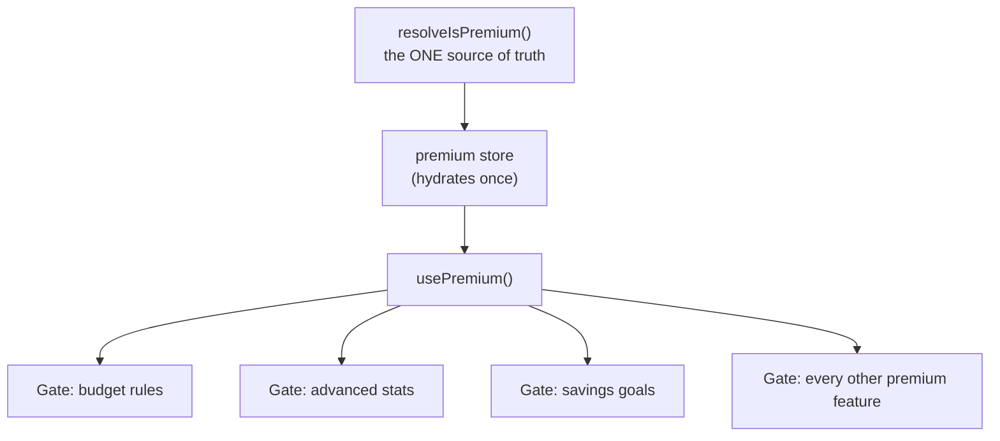
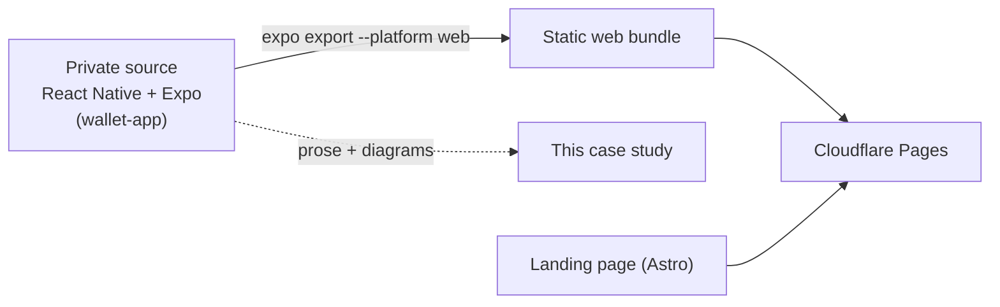

# Wall it — case study & web demo

[](https://github.com/eliegeorgioelkhoury/wall-it-showcase/actions/workflows/ci.yml)
[](LICENSE)

> **Local-first personal finance. Your data never leaves your device.**
> Wall it is a React Native + Expo app whose budgets, transactions, and
> achievements live in an on-device SQLite database — no account, no server
> round-trip for your financial data. Privacy by architecture, not by policy.

This is the **public** presentation for Wall it: a marketing landing page, this
prose-and-diagrams case study, and a bundled web build of the app. **The app
source stays private** — only the write-up and the compiled web demo are public.

- 🔗 **Web demo** — _pending._ The app compiles to the web, but its on-device
  SQLite (`expo-sqlite` → WASM) needs cross-origin isolation **and** further
  web adaptation to run in a browser; rather than ship a broken demo, a live
  build is deferred. Details in [`web-demo/`](web-demo/README.md).
- 📱 **On the App Store** — _coming soon_

---

## Why local-first

Most personal-finance apps are thin clients over someone else's database: every
transaction you log is uploaded, joined to your identity, and retained on a
server you don't control. Wall it inverts that. The **device is the source of
truth**. The app reads and writes a local SQLite database directly, works with
the network permanently off, and never needs an account.

That single decision — *where the data lives* — is what makes the privacy claim
structural rather than a promise in a policy. The four sections below are the
architecture that follows from it.

---

## How it works

Four decisions define the app. Each is summarised here; none of them require
seeing the source to understand.

| Decision | One line |
|---|---|
| [Local-first data model](#local-first-data-model) | The device is the single source of truth; SQLite is authoritative, sync is optional. |
| [Rule-based budgeting engine](#rule-based-budgeting-engine) | Deterministic bucket rules + a rollover engine turn income and spending into explainable budgets. |
| [Append-only achievements store](#append-only-achievements-store) | Earned badges are appended, never mutated; state is a fold over the log. |
| [Single-source-of-truth premium entitlement](#single-source-of-truth-premium-entitlement) | One authoritative check gates every premium feature; real billing swaps in behind it. |

---

### Local-first data model

The whole app is built on a **repository pattern over on-device SQLite**
(via [Drizzle ORM](https://orm.drizzle.team/) and `expo-sqlite`). Screens never
touch SQL. They call query functions; those functions are the only place SQL
lives; the database file sits on the phone.



The rules that keep it honest:

- **The device is authoritative.** Every read and write hits SQLite. There is no
  network call in the core flows, so the app is fully usable offline and instant
  — no spinner waiting on a server.
- **Repository boundary.** SQL exists only in the query layer. Screens depend on
  functions, not tables, so the storage engine is swappable and testable.
- **Pure business logic.** Budget math, currency conversion, and statistics are
  pure functions with no React and no I/O — trivially unit-testable, and the
  reason the rules below can be verified in isolation.
- **Money is integer minor units.** A balance of `123.45` is stored as `12345`.
  Floats never touch money. Currency conversions are explicit and dated, never
  silently mixed.
- **Soft deletes + forward-only migrations.** Domain rows carry a `deleted_at`
  tombstone instead of vanishing; schema changes are numbered, append-only SQL
  files applied on launch. History is preserved, not overwritten.

**Sync is an add-on, not a dependency.** An optional engine can mirror the
synced tables to Supabase (Postgres + Row-Level Security) for cloud *backup* —
but SQLite stays the source of truth, and with no credentials configured the
feature simply reports "unavailable" and nothing else changes. Local-first is
the default; the cloud is opt-in.

---

### Rule-based budgeting engine

Budgeting is two deterministic layers stacked on top of each other: a **rules
engine** that proposes a plan, and a **rollover engine** that tracks it over
time. Both are pure and explainable — no black-box "AI budget," just arithmetic
you can audit.

#### 1 · Bucket rules (the plan)

Every budgeting strategy splits take-home money across three **fixed buckets** —
`needs`, `wants`, `savings`. A strategy is nothing but three **integer
percentages that must sum to exactly 100**; one validator is the single source
of truth for "are these ratios valid," reused by the presets and any custom
editor.

| Strategy | Needs | Wants | Savings |
|---|---:|---:|---:|
| **50 / 30 / 20** | 50 | 30 | 20 |
| **70 / 20 / 10** | 70 | 20 | 10 |
| **60 / 30 / 10** | 60 | 30 | 10 |



The generator turns *strategy + income* into concrete per-category budgets by
mapping each category to a bucket. Generated budgets are **stamped with a
`source` marker**; manually created budgets leave it null. That one field keeps
the two worlds cleanly separated — regenerating or clearing a rule touches only
the rule-generated budgets and never the ones you made by hand.

#### 2 · Rollover (the plan over time)

Each budget plays out over repeating periods (weekly / monthly / yearly). Rather
than run a background job, periods are **materialised lazily on read**: when you
open the budgets screen, the engine walks forward from the last known period,
creating any missing ones and carrying the balance across according to the
budget's rollover mode.

For a closing period, **net = allocated + rolled-in − spent**, and the next
period's rolled-in is:

| Mode | Carries forward |
|---|---|
| `none` | nothing — reset every period |
| `positive` | only a surplus (`max(0, net)`) |
| `negative` | only an overspend (`min(0, net)`) |
| `both` | the full net — true envelope behaviour |

```
period N            period N+1          period N+2
┌──────────────┐    ┌──────────────┐    ┌──────────────┐
│ allocated 500│    │ allocated 500│    │ allocated 500│
│ rolled-in  0 │ ─► │ rolled-in +80│ ─► │ rolled-in −40│
│ spent    420 │    │ spent    620 │    │ spent    ... │
│ net      +80 │    │ net      −40 │    │              │
└──────────────┘    └──────────────┘    └──────────────┘
     surplus carries      overspend carries   (mode: both)
```

`spent` is always summed live from transactions, never stored — so a
**backdated transaction** dropped into a closed period is handled correctly: the
period's spend re-derives, and a cascade recomputes the rolled-in chain for
every period after it. Change a budget's amount and it applies from the next
period on; past periods keep their historical allocation. The result is a
rollover trail you can read like a bank statement.

---

### Append-only achievements store

Badges (savings streaks, habit milestones) are stored in an **append-only log**.
The first time a badge's criterion is satisfied, a row is inserted into
`earned_achievements`. Rows are **never updated and never deleted** — there is no
"un-earn." Current state is derived by **folding the log**.



Two deliberate design choices make this robust:

- **Detection is pure; persistence is separate.** A pure function takes assembled
  inputs and returns the ids of every badge whose criterion currently holds — no
  I/O, fully testable. A thin reconcile step decides which of those are *newly*
  earned and appends them. Earned always sticks, even if the underlying numbers
  later dip.
- **No natural-key uniqueness — on purpose.** There is intentionally no
  `UNIQUE(user, achievement_id)` constraint. Inserts never conflict (which keeps
  per-row sync idempotent and merge-friendly), and a rare duplicate is harmless
  because the read layer **dedupes by achievement id**. The log stays
  append-only and conflict-free; correctness lives in the fold, not in a
  constraint.

An append-only log is also the friendliest possible shape for eventual
cross-device sync: appends from two devices merge without conflict, and replaying
the log always reproduces the same badge set.

---

### Single-source-of-truth premium entitlement

Premium gating is centralised to **one authoritative resolver**. A single
function decides whether the user is premium; a small store hydrates from it; a
`usePremium()` hook exposes it; and **every gate in the app derives from that one
value**. Nothing tracks premium state in two places.



Why it matters:

- **Swapping in real billing is a one-function change.** Today the resolver reads
  a device-local developer switch (so every gate is testable without a store
  account). Moving to real billing (StoreKit / an entitlements SDK) replaces the
  body of that **single function** — the store, the hook, and every gate stay
  byte-for-byte the same.
- **Entitlement is device-local and non-synced — deliberately.** An entitlement
  comes from the app store, not from the user's synced financial data, so it
  lives outside the sync pipeline entirely: no migration, no cloud column, no
  sync-engine coupling. That keeps the privacy boundary intact — your purchase
  status never rides along with your transactions.

One value in, one place to change, every gate consistent.

---

## About this repository (the showcase)

This repo is **presentation only** — it contains no application source.



- **Landing page** — an [Astro](https://astro.build/) static site (`src/`) whose
  thesis is "your data never leaves your device," with a signature on-device
  **data-orbit** animation and gentle scroll reveals, all honouring
  `prefers-reduced-motion`.
- **Web demo** — _deferred._ The app exports to a static web bundle via
  `expo export --platform web`, but it relies on on-device SQLite, which needs
  browser cross-origin isolation and web-specific shims to actually run. See
  [`web-demo/`](web-demo/README.md) for the full findings.
- **Case study** — this document.

## Design

- **Tokens:** Pine · Mint · Ink · Honey · Coin silver.
- **Type:** General Sans (display) · Inter (text) — self-hosted, no third-party
  font CDN at runtime.
- **Signature motion:** an on-device data-orbit — data points circling a phone,
  contained inside the device boundary, with the cloud severed outside — plus
  scroll reveals. Everything collapses to a static, legible state under
  `prefers-reduced-motion`.

## Run the landing locally

```sh
npm ci
npm run dev      # http://localhost:4321
npm run build    # static output -> dist/
```

## Repo layout

```
wall-it-showcase/
├── src/          # Astro landing site (pages, layout, components, styles)
├── public/       # static assets (self-hosted fonts, favicon)
├── web-demo/     # bundled Expo web export — build artifact only, no source
└── docs/         # diagrams / assets for this write-up
```

## License

[MIT](LICENSE) — applies to the landing / showcase code in this repo only.
The Wall it application source is private and not covered by this license.
© 2026 Elie El Khoury
